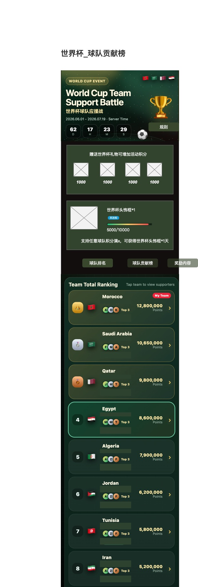
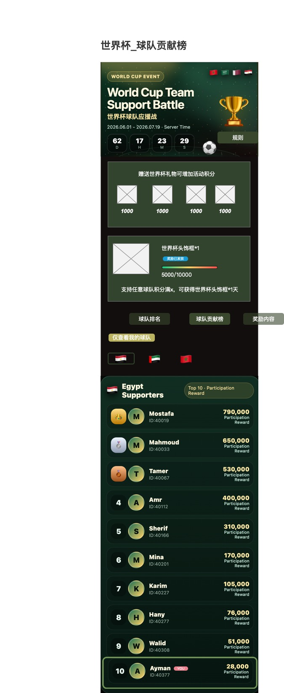

# 2026世界杯球队应援战 活动需求文档

> **生成时间**：2026-05-19 14:45
> **源材料**：世界杯活动功能脑图.xmind、原型图/世界杯活动球队贡献榜.jpg、原型图/世界杯活动球队排名.jpg
> **采用原则**：以脑图为功能结构和规则主来源，原型图为页面布局和视觉证据，两者冲突时以脑图规则为准

---

## 一、需求背景与活动定位

### 1.1 业务背景

中东语聊平台在世界杯周期内上线轻量活动，通过世界杯主题礼物制造房间氛围和用户送礼理由，通过球队排名和球队贡献榜增强阵营感、荣誉感和冲榜动力。

活动以**低研发成本**为原则，优先复用现有礼物、榜单、奖励、活动页能力。

### 1.2 活动定位

| 维度 | 内容 |
|---|---|
| 活动类型 | 世界杯主题礼物积分活动 + 球队阵营应援活动 + 榜单冲榜活动 |
| 活动关键词 | 世界杯、球队应援、送礼积分、球队排名、球队贡献榜、虚拟装扮奖励 |
| 核心机制 | 用户赠送指定世界杯活动礼物 → 积分计入绑定球队 → 球队排名 + 个人贡献榜 → 奖励发放 |

### 1.3 活动目标

- 增加世界杯期间活动礼物消费
- 提升用户送礼参与率
- 提升中东用户对球队/国家主题活动的参与感
- 给普通用户提供低门槛积分奖励
- 给中高付费用户提供榜单竞争和荣誉奖励
- 为房间运营提供世界杯期间的话题和送礼理由

### 1.4 非目标（明确不做）

- ❌ 世界杯竞猜
- ❌ 比分预测
- ❌ 押注/赔率玩法
- ❌ 根据真实比赛胜负结算奖励
- ❌ 复杂赛程系统
- ❌ 后台配置页面
- ❌ 复杂运营数据看板

---

## 二、用户角色

| 角色 | 核心行为 |
|---|---|
| 普通用户 | 查看活动规则、赠送世界杯礼物、为指定球队贡献积分、查看球队排名、查看自己在球队贡献榜中的排名、达成积分门槛后领取奖励 |
| 付费用户/冲榜用户 | 通过赠送更多世界杯礼物提高球队积分、提升自己在指定球队贡献榜中的排名、争夺榜单奖励、通过榜单身份获得荣誉展示 |
| 房间用户 | 在房间内看到世界杯礼物、通过送礼参与活动、通过公屏/动效感知他人应援行为、被活动氛围带动参与送礼 |
| 平台运营 | 确认活动周期、确认活动球队、确认活动礼物、确认奖励内容、活动结束后查看最终榜单、发放榜单奖励 |

---

## 三、核心业务规则

### 3.1 参与方式

- 用户在活动期间赠送**指定世界杯活动礼物**
- 活动礼物需**绑定一个球队**
- 用户赠送礼物后，为该礼物绑定球队增加**活动积分**
- 用户个人也获得该球队下的**贡献积分**

### 3.2 积分规则

#### 积分来源

用户成功赠送世界杯活动礼物即产生活动积分。

#### 积分计算公式

- **活动积分** = 礼物积分值 × 礼物数量
- 默认规则：1 金币 = 1 活动积分（已确认）

#### 不计入积分的情况

| 场景 | 处理 |
|---|---|
| 非活动礼物 | 不计入 |
| 礼物赠送失败 | 不计入 |
| 活动开始前赠送 | 不计入 |
| 活动结束后赠送 | 不计入 |
| 被系统判定异常的礼物流水 | 不计入，且可能取消奖励资格 |

### 3.3 球队积分规则

- 每个球队独立累计活动积分
- 用户赠送某球队礼物，**只计入该球队积分**
- 球队总积分用于球队排名
- 活动结束时生成最终球队排名

### 3.4 用户贡献规则

- 用户对每个球队的贡献积分**独立统计**
- 用户可支持多个球队
- 用户在不同球队下分别拥有贡献排名
- 用户个人贡献积分用于球队贡献榜排名
- 用户活动总贡献积分用于进度奖励

### 3.5 奖励规则

#### 奖励类型

| 类型 | 触发条件 | 发放方式 |
|---|---|---|
| 球队排名奖励 | 活动结束后，球队总积分排名前3的球队为优胜球队，队内贡献榜Top 10用户获得大奖 | 活动结束后统一发放 |
| 球队贡献参与奖 | 每个球队贡献榜Top 10用户获得参与奖 | 活动结束后统一发放 |
| 积分进度奖励 | 用户活动期间累计积分达到指定门槛，系统自动发放世界杯装扮奖励 | 达成后系统自动发放 |

#### 奖励叠加规则

- 同一用户同时满足多个榜单奖励时，允许叠加发放
- 大奖和参与奖可同时获得，允许叠加发放
- 是否叠加由活动规则明确说明

#### 发奖时间

| 奖励类型 | 发奖时间 |
|---|---|
| 进度奖励 | 达成后系统自动发放 |
| 榜单奖励 | 活动结束后统一发放 |

---

## 四、页面结构与功能模块

### 4.1 活动首页（总览）

#### 对应原型

活动首页承载世界杯活动整体信息，原型图中的顶部Banner、礼物积分说明、进度奖励、Tab导航均属于首页范畴。



**功能描述：** 球队排名Tab下的活动首页完整布局，包含顶部Banner、礼物积分说明、进度奖励卡片、Tab导航和球队排名列表。
**关键交互：** 点击球队卡片切换至球队贡献榜；点击Tab切换不同内容区。

#### 模块说明

活动首页用于承载世界杯活动整体信息，包含活动主题、倒计时、积分说明、进度奖励、榜单入口和规则说明。

#### 展示内容

| 区域 | 内容 |
|---|---|
| 顶部Banner | 活动标题、活动副标题、活动时间、活动倒计时、规则入口 |
| 礼物积分说明 | 世界杯礼物积分说明、活动礼物展示 |
| 进度奖励 | 用户积分进度奖励 |
| Tab导航 | 球队排名 / 球队贡献榜 / 奖励内容 |

#### 页面状态

| 状态 | 倒计时 | 榜单 | 积分 | 进度奖励 |
|---|---|---|---|---|
| 活动未开始 | 展示距离开始的倒计时 | 可隐藏或展示空态 | 不累计 | 奖励不可发放 |
| 活动进行中 | 正常展示倒计时 | 正常展示 | 正常累计 | 达成后自动发放 |
| 活动已结束 | 展示"活动已结束" | 展示最终榜单 | 停止增长 | 进度奖励为系统自动发放，活动期间达成即发放，活动结束后无补领场景 |

---

### 4.2 顶部Banner模块

#### 对应原型


**功能描述：** 顶部Banner区域包含活动标签WORLD CUP EVENT、英文标题World Cup Team Support Battle、中文副标题世界杯球队应援战、活动时间2026.06.01-2026.07.19、倒计时组件和规则按钮。
**关键交互：** 点击规则按钮打开活动规则弹窗；倒计时实时刷新，到达结束时间后切换为已结束状态。

#### 功能说明

- 向用户传达活动主题和活动时间
- 建立世界杯氛围
- 提供规则入口

#### 展示字段

| 字段 | 说明 | 数据来源 |
|---|---|---|
| 活动标签 | 展示活动类型标识，如"WORLD CUP EVENT" | 活动配置 |
| 活动标题 | 活动主标题，如"World Cup Team Support Battle" | 活动配置 |
| 活动副标题 | 活动本地化标题或中文标题 | 活动配置 |
| 活动开始时间 | 活动正式开始时间，如2026.06.01 | 活动配置 |
| 活动结束时间 | 活动正式结束时间，如2026.07.19 | 活动配置 |
| 服务器时间说明 | 说明活动时间以服务器时间为准 | 活动配置 |
| 剩余天数/小时/分钟/秒数 | 倒计时组件各维度数值 | 前端计算（服务器时间差） |
| 规则按钮 | 活动规则弹窗入口 | 前端固定 |

#### 交互逻辑

1. 用户进入活动页 → 系统请求活动基础信息
2. 前端按服务器返回时间差开始倒计时
3. 到达活动结束时间 → 切换为活动已结束状态
4. 点击规则按钮 → 打开活动规则弹窗

---

### 4.3 世界杯礼物积分说明模块

#### 对应原型


**功能描述：** 礼物积分说明区域展示"赠送世界杯礼物可增加活动积分"文案，横向排列4个世界杯活动礼物图标，每个礼物下方标注积分值（如1000）。
**关键交互：** 点击礼物图标跳转至房间礼物面板或打开活动礼物面板；不在房间内时引导进入推荐房间或展示提示。

#### 功能说明

- 告诉用户赠送世界杯礼物可以获得活动积分
- 展示活动礼物和对应积分
- 引导用户去礼物栏送礼

#### 展示字段

| 字段 | 说明 | 数据来源 |
|---|---|---|
| 模块标题 | 展示礼物积分说明文案，如"赠送世界杯礼物可增加活动积分" | 活动配置 |
| 礼物图标 | 世界杯活动礼物图标 | 礼物系统 |
| 礼物名称 | 活动礼物名称 | 礼物系统 |
| 礼物积分 | 赠送该礼物可获得的活动积分 | 活动礼物配置 |
| 绑定球队 | 该礼物对应支持的球队 | 活动礼物配置 |
| 礼物价格 | 礼物金币价格，可选展示 | 礼物系统 |
| 送礼入口 | 跳转礼物面板或房间的入口 | 前端固定 |

#### 逻辑规则

- 仅展示活动期间有效的世界杯礼物
- 每个礼物ID固定绑定一个球队（平台配置多个"同款不同队"的礼物，用户无需选择球队）
- 礼物积分用于活动榜单和用户进度
- 活动结束后，运营手动下架世界杯活动礼物，下架后不再展示在活动页
- 若礼物下架，不再展示在活动页

#### 交互逻辑

1. 用户点击礼物 → 跳转至房间礼物面板或打开活动礼物面板
2. 若用户在房间内：打开礼物栏
3. 若用户不在房间内：引导进入推荐房间或展示提示

---

### 4.4 积分进度奖励模块

#### 对应原型


**功能描述：** 进度奖励卡片展示奖励图标、奖励名称（如世界杯头饰框*1）、奖励状态标签（未达成/待发放/已发放）、进度条（当前积分/目标积分，如5000/10000）和规则说明文案。
**关键交互：** 未达标时展示"未达成"状态；积分达到门槛后系统自动发放，状态变为"待发放"→"已发放"；已发放后展示已发放状态。

#### 功能说明

- 给普通用户提供低门槛参与目标
- 用户累计贡献达到指定积分后获得活动奖励
- 降低纯榜单活动对非大R用户的劝退感

#### 展示字段

| 字段 | 说明 | 数据来源 |
|---|---|---|
| 奖励图标 | 进度奖励对应的虚拟装扮或道具图标 | 奖励配置 |
| 奖励名称 | 奖励名称，如"世界杯头饰框*1" | 奖励配置 |
| 奖励有效期 | 奖励可使用时长 | 奖励配置 |
| 目标积分 | 领取奖励所需达到的活动积分 | 奖励配置 |
| 当前积分 | 当前用户已获得的活动总积分 | 用户活动数据 |
| 进度百分比 | 当前积分 ÷ 目标积分（最大展示不超过100%） | 前端计算 |
| 奖励状态 | 未达成 / 待发放 / 已发放 | 前端判断+奖励进度接口 |
| 奖励说明 | 解释奖励获得条件 | 活动配置 |
| 奖励状态标识 | 展示当前奖励发放状态（未达成/待发放/已发放） | 前端判断 |

#### 状态设计

| 状态 | 条件 | 按钮样式 | 点击行为 |
|---|---|---|---|
| 未达成 | 当前积分 < 目标积分 | — | 展示未达成状态 |
| 待发放 | 当前积分 ≥ 目标积分 且未发放 | — | 系统自动发放 |
| 已发放 | 已发放 | 展示已发放 | — |

#### 逻辑规则

- 当前积分来源：用户活动期间赠送世界杯礼物产生的总积分
- 进度计算：进度百分比 = 当前积分 ÷ 目标积分，最大展示不超过100%
- 发放限制：每个进度奖励每个用户仅发放一次
- 奖励发放方式为系统自动发放，无需用户操作
- 推荐MVP规则：活动期累计积分达到门槛后系统自动发放一次奖励，不做每日重置

#### 交互逻辑

1. 页面加载 → 请求用户活动总积分和奖励进度
2. 前端判断奖励状态并渲染（未达成/待发放/已发放）
3. 用户积分达到目标门槛 → 系统自动发放奖励
4. 发放成功 → 状态变为已发放，展示发放成功提示
5. 发放失败 → 系统后台记录，支持重试自动补发

---

### 4.5 Tab导航模块

#### 对应原型



**功能描述：** 横向排列3个Tab选项卡：球队排名（未选中深灰背景）、球队贡献榜（选中绿色背景带阴影）、奖励内容（未选中深灰背景）。
**关键交互：** 默认选中球队排名Tab；点击球队排名中的某个球队自动切换至球队贡献榜并加载该球队数据；点击球队贡献榜Tab默认展示用户支持过的球队。

#### Tab类型

| Tab | 默认选中 | 说明 |
|---|---|---|
| 球队排名 | ✅（默认） | 展示各球队总积分排名 |
| 球队贡献榜 | ❌ | 展示指定球队下的用户贡献排名 |
| 奖励内容 | ❌ | 展示奖励规则和奖励内容 |

#### 交互逻辑

1. 默认选中球队排名Tab
2. 点击球队排名中的某个球队 → 记录选中球队 → 自动切换至球队贡献榜 → 加载该球队贡献榜数据
3. 点击球队贡献榜Tab → 默认展示用户支持过的球队；若用户未支持任何球队，默认展示排名最高球队
4. 点击奖励内容Tab → 展示奖励规则和奖励内容

---

### 4.6 球队排名模块

#### 对应原型


**功能描述：** 球队排名Tab下的完整列表，按球队总积分降序排列。每行展示排名序号（Top1/2/3有特殊奖牌样式）、国旗、球队名称、支持人数、球队总积分、Top3贡献者头像缩略、状态标签（领先/前三/我的球队）。当前用户支持过的球队展示"我的球队"标签。选中球队卡片描边高亮。
**关键交互：** 点击球队卡片或箭头 → 切换至球队贡献榜Tab，加载该球队贡献榜；当前选中球队卡片描边高亮。

#### 功能说明

- 展示各球队的总积分排名
- 让用户感知球队阵营竞争
- 引导用户点击球队查看贡献榜

#### 展示字段

| 字段 | 说明 | 数据来源 |
|---|---|---|
| 球队排名 | 当前球队在活动中的名次 | 球队排名接口 |
| 球队ID | 球队唯一标识 | 球队配置 |
| 球队名称 | 球队展示名称，如Morocco、Saudi Arabia | 球队配置 |
| 球队国旗 | 球队所属国家/地区国旗 | 球队配置 |
| 球队图标 | 球队图标或活动视觉图，可选 | 球队配置 |
| 球队总积分 | 该球队累计获得的活动积分 | 球队排名接口 |
| 支持人数 | 给该球队贡献过积分的去重用户数 | 球队排名接口 |
| 球队状态标签 | 领先 / 前三 / 我的球队 | 前端判断 |
| 是否我的球队 | 当前用户是否给该球队贡献过积分 | 用户活动数据 |
| 是否当前选中球队 | 当前页面正在查看的球队 | 前端状态 |
| 排名奖牌样式 | Top1/2/3特殊视觉样式（金/银/铜） | 前端渲染 |

#### 排名逻辑

- **排序字段**：球队总积分降序
- **积分相同处理**：按积分最后变更时间排序，先达到的排名靠前（需记录积分最后变更时间戳）
- **支持人数统计**：对该球队贡献积分>0的去重用户数
- **我的球队判断**：当前用户对该球队贡献积分 > 0（与支持人数口径一致）

#### 状态标签逻辑

| 标签 | 条件 | 样式 |
|---|---|---|
| 领先（Leading） | 当前排名第1 | 绿色标签 |
| 前三（Top 3） | 当前排名第2-3 | 绿色标签 |
| 我的球队（My Team） | 当前用户支持过的球队 | 红色标签 |

#### 交互逻辑

1. 页面加载 → 请求球队排名数据
2. 按总积分降序展示球队列表
3. 点击球队卡片或箭头 → 设置当前选中球队 → 跳转/切换至球队贡献榜 → 加载该球队贡献榜
4. 当前选中球队 → 卡片描边高亮
5. 榜单刷新：每次进入活动页时刷新榜单数据

#### 空状态

| 场景 | 文案 |
|---|---|
| 暂无球队积分 | 暂无球队积分数据 |
| 活动未开始 | 活动未开始，暂无排名 |
| 当前暂无用户支持球队 | 快来送出世界杯礼物，为球队加油 |

---

### 4.7 球队贡献榜模块

#### 对应原型


**功能描述：** 球队贡献榜Tab下的完整页面，顶部展示筛选区（"仅查看我的球队"开关 + 国旗筛选按钮），下方展示当前选中球队（如Egypt Supporters）的贡献排行榜卡片。卡片头部展示球队国旗、球队名称和奖励资格标签（Top 10 · Participation Reward 或 Grand Prize）。排行榜列表展示Top10用户排名、头像、昵称、ID、贡献积分和奖励资格。
**关键交互：** 点击国旗筛选切换球队贡献榜；开启"仅查看我的球队"只展示用户贡献过积分的球队；当前用户在Top10内则高亮；不在Top10则在底部展示"我的排名"卡片。

#### 功能说明

- 展示指定球队下的用户贡献排名
- 用户可查看自己在某球队下的贡献排名
- 用于承载榜单奖励资格展示

#### 展示字段

| 字段 | 说明 | 数据来源 |
|---|---|---|
| 当前选中球队ID | 当前正在查看贡献榜的球队唯一标识 | 前端状态 |
| 当前选中球队名称 | 当前贡献榜对应的球队名称，如"Egypt Supporters" | 球队配置 |
| 当前选中球队国旗 | 当前贡献榜对应的球队国旗 | 球队配置 |
| 奖励资格说明 | 说明当前球队Top用户可获得的奖励类型 | 活动配置+球队排名 |
| 用户排名 | 用户在当前球队贡献榜中的名次 | 球队贡献榜接口 |
| 用户头像 | 用户头像 | 用户资料 |
| 用户昵称 | 用户展示昵称 | 用户资料 |
| 用户ID | 用户唯一标识或展示ID | 用户资料 |
| 用户贡献积分 | 用户对当前球队贡献的活动积分 | 球队贡献榜接口 |
| 奖励资格 | 大奖资格 / 参与奖资格 / 无奖励资格 | 前端判断 |
| 是否当前用户 | 该行用户是否为当前登录用户 | 前端判断 |
| 当前用户标识 | 如"YOU"或"我"标签 | 前端固定 |

#### 榜单逻辑

- **榜单范围**：当前选中球队
- **排序字段**：用户贡献积分降序
- **积分相同处理**：按积分最后变更时间排序，先达到的排名靠前（需记录积分最后变更时间戳）
- **展示数量**：默认展示Top N（活动配置项，默认值10）
- **当前用户展示**：
  - 当前用户在Top N（默认10）内：在对应排名行高亮
  - 当前用户不在Top N：可在榜单底部展示"我的排名"卡片

#### 奖励资格逻辑

| 条件 | 奖励资格 | 标签样式 |
|---|---|---|
| 当前球队属于球队总榜Top 3 且 队内Top N（默认10）用户 | 大奖资格（Grand Prize） | 特殊样式 |
| 当前球队不属于球队总榜Top 3 且 队内Top N（默认10）用户 | 参与奖资格（Participation Reward） | 橄榄绿标签 |
| 非Top N用户 | 无奖励资格 | 不显示或显示"无" |

> **注意**：活动进行中奖励资格标签为实时预估，最终以活动结束时榜单为准，标签旁需标注"实时预估"说明文案。

#### 球队筛选交互

1. 展示可切换球队入口（国旗按钮横向排列）
2. 用户可点击不同球队国旗切换贡献榜
3. 当前选中球队国旗高亮
4. 提供"仅查看我的球队"开关，默认关闭
   - 开启后只展示用户贡献过积分的球队
   - 用户未支持任何球队时展示空态和送礼引导

#### 点击交互

1. 点击球队筛选 → 切换当前选中球队 → 重新请求贡献榜
2. 点击用户行 → 可进入用户主页（可选）
3. 点击当前用户行 → 可展示我的贡献详情（可选）

#### 空状态

| 场景 | 文案 |
|---|---|
| 当前球队暂无贡献用户 | 暂无用户支持该球队 |
| 用户未支持该球队 | 你还没有支持该球队 |
| 引导送礼 | 送出世界杯礼物，为该球队增加积分 |

---

### 4.8 奖励内容模块

#### 功能说明

- 展示活动奖励规则
- 解释用户如何获得奖励
- 降低榜单奖励理解成本

#### 展示内容

| 区域 | 内容 |
|---|---|
| 积分进度奖励 | 用户累计活动积分达到门槛后领取 |
| 球队排名奖励 | 优胜球队内贡献榜Top用户获得大奖 |
| 球队贡献榜奖励 | 每个球队贡献榜Top用户获得参与奖 |
| 发奖时间 | 榜单奖励活动结束后统一发放 |
| 奖励注意事项 | 以最终榜单数据为准等 |

#### 展示字段

| 字段 | 说明 | 数据来源 |
|---|---|---|
| 奖励类型 | 进度奖励 / 榜单大奖 / 参与奖励 | 奖励配置 |
| 奖励名称 | 奖励展示名称 | 奖励配置 |
| 奖励图标 | 奖励对应图标 | 奖励配置 |
| 获得条件 | 用户获得该奖励需要满足的条件 | 奖励配置 |
| 奖励有效期 | 奖励可使用时长 | 奖励配置 |
| 发奖时间 | 奖励预计发放时间 | 活动配置 |
| 奖励说明 | 补充解释奖励规则 | 活动配置 |

#### 奖励规则展示

| 奖励类型 | 规则说明 |
|---|---|
| 进度奖励 | 用户累计活动积分达到门槛后领取 |
| 优胜球队奖励 | 球队总积分Top 3的球队为优胜球队，优胜球队内贡献榜Top 10用户获得大奖 |
| 参与奖励 | 每个球队贡献榜Top 10用户获得参与奖 |
| 发奖说明 | 榜单奖励将在活动结束后统一发放，以最终榜单数据为准 |

---

### 4.9 规则弹窗模块

#### 功能说明

- 在不离开活动页的情况下展示活动规则
- 帮助用户理解积分、榜单、奖励和异常处理

#### 展示内容

| 内容项 | 说明 |
|---|---|
| 活动时间 | 活动起止时间 |
| 参与方式 | 赠送指定世界杯活动礼物 |
| 积分规则 | 积分计算方式和不计入场景 |
| 球队排名规则 | 球队总积分排名逻辑 |
| 球队贡献榜规则 | 用户贡献排名逻辑 |
| 奖励规则 | 各类奖励获得条件 |
| 发奖说明 | 榜单奖励发放时间和方式 |
| 异常数据说明 | 异常流水和风控处理 |

#### 交互逻辑

1. 点击规则按钮 → 打开规则弹窗
2. 点击关闭按钮 → 关闭弹窗
3. 点击弹窗外区域 → 关闭弹窗（可选）
4. 弹窗内容较长时 → 支持内部滚动

---

## 五、数据字段定义

### 5.1 活动基础信息字段

| 字段 | 说明 |
|---|---|
| 活动ID | 活动唯一标识 |
| 活动名称 | 活动内部名称 |
| 活动标题 | 活动页面主标题 |
| 活动副标题 | 活动页面副标题 |
| 活动状态 | 未开始 / 进行中 / 已结束 |
| 活动开始时间 | 活动开始统计时间 |
| 活动结束时间 | 活动停止统计时间 |
| 当前服务器时间 | 用于倒计时和活动状态判断 |
| 活动规则文案 | 活动规则说明内容（多语言） |
| 活动Banner图片 | 顶部活动视觉图 |
| 活动背景图 | 活动页背景视觉图 |

### 5.2 球队字段

| 字段 | 说明 |
|---|---|
| 球队ID | 球队唯一标识 |
| 球队名称 | 球队展示名称 |
| 球队本地化名称 | 不同语言下的球队名称 |
| 球队国旗 | 球队所属国家/地区国旗 |
| 球队图标 | 球队图标或活动视觉图 |
| 球队展示顺序 | 球队在筛选或列表中的默认展示顺序 |
| 球队展示状态 | 球队是否在活动页展示 |
| 是否可参与活动 | 球队是否参与本次活动积分统计 |

#### 活动球队清单（已确认）

| 序号 | 球队（国家） | 英文名 |
|---:|---|---|
| 1 | 摩洛哥 | Morocco |
| 2 | 沙特 | Saudi Arabia |
| 3 | 卡塔尔 | Qatar |
| 4 | 埃及 | Egypt |
| 5 | 阿尔及利亚 | Algeria |
| 6 | 约旦 | Jordan |
| 7 | 阿联酋 | UAE |
| 8 | 伊拉克 | Iraq |
| 9 | 叙利亚 | Syria |

### 5.3 活动礼物字段

| 字段 | 说明 |
|---|---|
| 礼物ID | 礼物唯一标识 |
| 礼物名称 | 礼物展示名称 |
| 礼物图标 | 礼物图标资源 |
| 礼物价格 | 礼物金币价格 |
| 礼物积分 | 赠送该礼物可获得的活动积分 |
| 绑定球队ID | 礼物绑定的球队唯一标识 |
| 是否活动礼物 | 是否计入本活动积分 |
| 礼物状态 | 礼物是否可展示、可赠送 |

### 5.4 用户活动字段

| 字段 | 说明 |
|---|---|
| 用户ID | 用户唯一标识 |
| 用户昵称 | 用户展示昵称 |
| 用户头像 | 用户头像资源 |
| 用户活动总积分 | 用户在活动期间获得的全部活动积分 |
| 用户球队贡献积分 | 用户在指定球队下贡献的活动积分 |
| 已支持球队列表 | 用户贡献过积分的球队列表 |
| 当前奖励进度 | 用户距离进度奖励目标的完成情况 |
| 奖励领取状态 | 用户奖励发放状态（未达成/待发放/已发放） |
| 积分最后变更时间 | 用户积分最后一次变更的时间戳，用于同积分排名判断 |

### 5.5 球队排名字段

| 字段 | 说明 |
|---|---|
| 球队ID | 球队唯一标识 |
| 球队排名 | 球队当前排名 |
| 球队总积分 | 球队累计活动积分 |
| 支持人数 | 支持该球队的去重用户数 |
| 是否优胜球队 | 是否进入榜单奖励范围 |
| 是否我的球队 | 当前用户是否支持过该球队 |
| 排名变化 | 球队排名较上次刷新是否变化（可选） |
| 状态标签 | 球队当前展示标签 |
| 积分最后变更时间 | 球队积分最后一次变更的时间戳，用于同积分排名判断 |

### 5.6 球队贡献榜字段

| 字段 | 说明 |
|---|---|
| 球队ID | 当前贡献榜对应球队 |
| 用户ID | 用户唯一标识 |
| 用户排名 | 用户在当前球队贡献榜中的排名 |
| 用户贡献积分 | 用户对当前球队贡献的活动积分 |
| 用户昵称 | 用户展示昵称 |
| 用户头像 | 用户头像资源 |
| 是否当前用户 | 该用户是否当前登录用户 |
| 奖励资格 | 用户当前排名对应的奖励资格 |

### 5.7 奖励字段

| 字段 | 说明 |
|---|---|
| 奖励ID | 奖励唯一标识 |
| 奖励名称 | 奖励展示名称 |
| 奖励图标 | 奖励图标资源 |
| 奖励类型 | 进度奖励 / 榜单大奖 / 参与奖励 |
| 获得条件 | 用户获得该奖励的条件 |
| 目标积分 | 进度奖励需要达到的积分门槛 |
| 奖励有效期 | 奖励可使用时长 |
| 领取状态 | 用户当前奖励领取状态 |
| 发放方式 | 系统自动发放 |

---

## 六、数据源与计算口径

### 6.1 活动基础信息数据源

| 项目 | 说明 |
|---|---|
| 来源 | 活动服务、运营活动配置 |
| 用途 | 活动页展示、活动状态判断、倒计时计算、规则展示 |

### 6.2 礼物数据源

| 项目 | 说明 |
|---|---|
| 来源 | 礼物系统 |
| 用途 | 判断礼物是否活动礼物、获取礼物价格、获取礼物积分、获取礼物绑定球队 |

### 6.3 礼物流水数据源

| 项目 | 说明 |
|---|---|
| 来源 | 用户成功送礼流水 |
| 关键条件 | 礼物属于世界杯活动礼物 AND 送礼时间在活动周期内 AND 送礼状态为成功 |
| 用途 | 计算球队总积分、计算用户球队贡献积分、计算用户进度奖励积分 |

### 6.4 球队总积分口径

| 项目 | 说明 |
|---|---|
| 统计对象 | 每个球队 |
| 统计范围 | 活动周期内成功赠送的该球队绑定礼物 |
| 计算公式 | 球队总积分 = 该球队所有活动礼物积分 × 礼物数量 的总和 |
| 用途 | 球队排名、判断优胜球队奖励资格 |

### 6.5 用户球队贡献积分口径

| 项目 | 说明 |
|---|---|
| 统计对象 | 用户 + 球队 |
| 统计范围 | 活动周期内用户成功赠送该球队绑定礼物 |
| 计算公式 | 用户球队贡献积分 = 用户赠送该球队活动礼物积分 × 礼物数量 的总和 |
| 用途 | 球队贡献榜、判断用户榜单奖励资格 |

### 6.6 用户活动总积分口径

| 项目 | 说明 |
|---|---|
| 统计对象 | 用户 |
| 统计范围 | 活动周期内用户赠送所有世界杯活动礼物 |
| 计算公式 | 用户活动总积分 = 用户所有活动礼物积分 × 礼物数量 的总和 |
| 用途 | 积分进度奖励、用户活动参与状态 |

### 6.7 支持人数口径

| 项目 | 说明 |
|---|---|
| 统计对象 | 球队 |
| 统计范围 | 活动周期内对该球队贡献积分>0的去重用户 |
| 计算公式 | 支持人数 = 去重用户ID计数 |
| 用途 | 球队排名卡片展示 |

### 6.8 最终榜单口径

| 项目 | 说明 |
|---|---|
| 统计时间 | 活动结束时间点 |
| 数据要求 | 生成最终榜单快照，结算奖励以最终快照为准 |
| 用途 | 榜单奖励发放、活动结束页展示 |

---

## 七、核心交互流程

### 7.1 用户进入活动页

```
用户点击活动入口
  → 系统请求活动基础信息
  → 系统判断活动状态（未开始/进行中/已结束）
  → 页面展示对应状态
  → 默认展示球队排名Tab
```

### 7.2 用户查看球队排名

```
页面请求球队排名数据
  → 展示球队排名列表
  → 用户查看各球队总积分和支持人数
  → 用户点击某个球队
  → 页面切换至球队贡献榜
  → 当前球队变为选中状态
```

### 7.3 用户查看球队贡献榜

```
页面根据选中球队请求贡献榜数据
  → 展示该球队Top用户
  → 当前用户在榜单中 → 用户行高亮
  → 当前用户不在Top展示范围 → 展示我的排名卡片
  → 用户可切换其他球队查看贡献榜
```

### 7.4 用户赠送世界杯礼物

```
用户点击送礼入口
  → 打开房间礼物面板或进入房间
  → 用户选择世界杯活动礼物
  → 系统完成送礼
  → 礼物系统产生成功送礼流水
  → 活动系统识别礼物绑定球队
  → 增加球队积分
  → 增加用户球队贡献积分
  → 增加用户活动总积分
  → 页面刷新用户积分和榜单数据
```

### 7.5 用户进度奖励发放

```
用户当前积分达到目标门槛
  → 奖励状态变为待发放
  → 系统自动发放奖励
  → 发放成功 → 状态更新为已发放，展示发放成功提示
  → 发放失败 → 系统后台记录，自动重试补发
```

### 7.6 活动结束结算

```
到达活动结束时间
  → 系统停止统计新积分
  → 生成球队最终排名
  → 生成各球队贡献榜最终排名
  → 根据规则判断奖励资格
  → 发放榜单奖励
  → 活动页展示最终榜单和结算说明
```

---

## 八、页面状态与异常处理

| 状态/异常 | 处理方式 |
|---|---|
| 活动未开始 | 展示预热信息，倒计时展示距离开始，榜单展示空态或不展示，奖励不可发放 |
| 活动进行中 | 正常展示倒计时、榜单、积分累计、奖励进度更新，达成后自动发放 |
| 活动已结束 | 展示活动已结束，榜单展示最终快照，不可继续获得积分，进度奖励为自动发放（活动期间达成即发放，结束后无补领场景），榜单奖励等待统一发放 |
| 用户未登录 | 展示活动内容，个人数据展示未登录态，点击领取/送礼/查看排名时引导登录 |
| 用户未参与 | 活动积分为0，我的排名展示未上榜，进度奖励展示0/目标积分，引导送礼 |
| 榜单无数据 | 展示空状态文案，引导送礼 |
| 数据刷新延迟 | 页面提示"榜单数据可能存在短暂延迟，请以最终结算为准"，用户个人积分建议优先保证实时或准实时 |
| 异常送礼流水 | 送礼失败不计积分，退款/撤销流水不扣回已计入积分，异常用户可取消奖励资格 |

---

## 九、奖励结算逻辑

### 9.1 进度奖励结算

| 项目 | 说明 |
|---|---|
| 触发条件 | 用户活动总积分达到目标积分 |
| 发放方式 | 系统自动发放 |
| 发放限制 | 每个用户每档奖励仅发放一次（系统自动发放，幂等键：用户ID + 奖励ID + 活动ID） |
| 失败处理 | 记录发放失败，支持重试或客服补发 |

### 9.2 球队排名奖励结算

| 项目 | 说明 |
|---|---|
| 触发时间 | 活动结束后 |
| 判断条件 | 球队总积分排名进入优胜范围 |
| 奖励对象 | 优胜球队内贡献榜Top用户 |
| 发放依据 | 活动结束时最终榜单快照 |
| 幂等键 | 用户ID + 球队ID + 奖励类型 + 活动ID |

### 9.3 参与奖结算

| 项目 | 说明 |
|---|---|
| 触发时间 | 活动结束后 |
| 判断条件 | 每个球队贡献榜Top用户 |
| 奖励对象 | 各球队贡献榜达标用户 |
| 与大奖关系 | 大奖与参与奖允许叠加发放 |
| 幂等键 | 用户ID + 球队ID + 奖励类型 + 活动ID |

### 9.4 奖励资格取消

| 场景 | 处理 |
|---|---|
| 用户存在异常行为 | 取消奖励资格 |
| 用户被平台风控命中 | 取消奖励资格 |
| 用户礼物流水被撤销或退款 | 不扣回已计入积分，但可取消该用户奖励资格 |
| 用户违反活动规则 | 取消奖励资格 |

---

## 十、MVP范围

### P0 必做

- 活动首页
- 活动倒计时
- 规则弹窗
- 世界杯礼物积分说明
- 积分进度奖励
- 球队排名
- 球队贡献榜
- 奖励内容
- 点击球队查看贡献榜
- 当前用户高亮
- 活动积分统计
- 球队总积分统计
- 用户球队贡献积分统计
- 进度奖励自动发放
- 活动结束榜单快照

### P1 可做

- 我的球队标签
- 仅查看我的球队
- Top3奖牌样式
- 当前用户未入榜时展示我的排名
- 距离Top10差距提示
- 房间公屏应援消息
- 礼物栏活动标签

### 暂不做

- 后台配置页面
- 房间应援进度条
- 房间榜
- 多档复杂任务
- 连续送礼任务
- Lucky Gift
- 世界杯竞猜
- 赛程联动
- 复杂运营数据看板
- 多层奖励自动配置系统

---

## 十一、验收标准

### 11.1 活动页验收

- 活动标题、时间、倒计时展示正确
- 活动状态切换正确
- 规则弹窗可正常打开和关闭
- 三个Tab可正常切换
- 页面样式适配移动端

### 11.2 积分验收

- 用户赠送活动礼物后，活动积分正确增加
- 用户赠送非活动礼物，不增加活动积分
- 用户赠送失败，不增加活动积分
- 礼物绑定球队后，积分计入正确球队
- 用户活动总积分、球队贡献积分、球队总积分口径一致

### 11.3 球队排名验收

- 球队按总积分降序排列
- 支持人数统计正确
- 当前用户支持过的球队可识别
- 点击球队可查看对应贡献榜
- 活动结束后最终榜单固定

### 11.4 球队贡献榜验收

- 贡献榜按用户对当前球队贡献积分排序
- 当前用户行高亮展示
- 切换球队后榜单数据正确变化
- Top用户奖励资格展示正确
- 用户支持多个球队时，各球队贡献独立计算

### 11.5 奖励验收

- 用户达到进度门槛后系统自动发放奖励
- 发放成功后状态变为已发放
- 已发放奖励不可重复发放
- 活动结束后按最终榜单判断奖励资格
- 大奖和参与奖冲突时，按规则处理

---

## 十二、风险与注意事项

| 风险 | 处理方式 |
|---|---|
| 用户混淆球队排名和球队贡献榜 | 页面明确说明：球队排名决定优胜球队，贡献榜决定用户奖励资格 |
| 纯榜单对普通用户吸引力不足 | 保留积分进度奖励，让普通用户有低门槛目标 |
| 球队数量过多导致用户分散 | 首版球队数量控制在10支以内 |
| 世界杯活动被理解为竞猜或博彩 | 禁止使用押注、下注、赔率、预测等表达，奖励只基于平台内礼物积分，不根据真实比赛结果发奖 |
| 榜单刷新存在延迟引发用户疑问 | 页面提示榜单数据可能存在短暂延迟，奖励以活动结束最终榜单为准 |

---

## 十三、源材料覆盖核对

| 脑图章节 | 文档对应章节 | 状态 |
|---|---|---|
| 1. 需求背景 | 一、需求背景与活动定位 | ✅ |
| 2. 用户角色 | 二、用户角色 | ✅ |
| 3. 活动核心规则 | 三、核心业务规则 | ✅ |
| 4.1 活动首页 | 四-4.1 活动首页 | ✅ |
| 4.2 顶部Banner模块 | 四-4.2 顶部Banner模块 | ✅ |
| 4.3 世界杯礼物积分说明模块 | 四-4.3 世界杯礼物积分说明模块 | ✅ |
| 4.4 积分进度奖励模块 | 四-4.4 积分进度奖励模块 | ✅ |
| 4.5 Tab导航模块 | 四-4.5 Tab导航模块 | ✅ |
| 4.6 球队排名模块 | 四-4.6 球队排名模块 | ✅ |
| 4.7 球队贡献榜模块 | 四-4.7 球队贡献榜模块 | ✅ |
| 4.8 奖励内容模块 | 四-4.8 奖励内容模块 | ✅ |
| 4.9 规则弹窗模块 | 四-4.9 规则弹窗模块 | ✅ |
| 5. 数据字段 | 五、数据字段定义 | ✅ |
| 6. 数据源与计算口径 | 六、数据源与计算口径 | ✅ |
| 7. 交互流程 | 七、核心交互流程 | ✅ |
| 8. 页面状态与异常处理 | 八、页面状态与异常处理 | ✅ |
| 9. 奖励结算逻辑 | 九、奖励结算逻辑 | ✅ |
| 10. MVP范围 | 十、MVP范围 | ✅ |
| 11. 验收标准 | 十一、验收标准 | ✅ |
| 12. 风险与注意事项 | 十二、风险与注意事项 | ✅ |

### 原型图覆盖核对

| 原型图 | 文档引用位置 | 状态 |
|---|---|---|
| 世界杯活动球队排名.jpg | 四-4.1 活动首页、四-4.2 顶部Banner、四-4.3 礼物积分说明、四-4.4 进度奖励、四-4.6 球队排名 | ✅ |
| 世界杯活动球队贡献榜.jpg | 四-4.5 Tab导航、四-4.7 球队贡献榜 | ✅ |

---

## 十四、待产品确认项

> 以下项目已根据产品确认结果更新，✅=已确认并同步到正文，⏳=待补充

| # | 问题 | 确认结果 | 状态 |
|---|---|---|---|
| 1 | 球队排名优胜范围 | Top 3 为优胜球队 | ✅ |
| 2 | 优胜球队内贡献榜Top几名获大奖 | Top 10 | ✅ |
| 3 | 每个球队贡献榜Top几名获参与奖 | Top 10 | ✅ |
| 4 | 积分进度奖励的具体档位和目标积分值 | 待补充 | ⏳ |
| 5 | 进度奖励发放方式 | 系统自动发放 | ✅ |
| 6 | 活动结束后已达成未领取的进度奖励 | 系统自动发放，不存在补领场景 | ✅ |
| 7 | 活动球队最终列表 | 9支：摩洛哥、沙特、卡塔尔、埃及、阿尔及利亚、约旦、阿联酋、伊拉克、叙利亚 | ✅ |
| 8 | 世界杯活动礼物的具体列表、积分值和绑定球队 | 待补充 | ⏳ |
| 9 | 礼物积分值换算规则 | 确认1金币=1积分 | ✅ |
| 10 | 活动周期 | 确认2026.06.01-2026.07.19 | ✅ |
| 11 | 榜单刷新机制 | 进入页面时刷新 | ✅ |
| 12 | 活动结束后礼物是否继续展示 | 运营手动下架 | ✅ |
| 13 | 大奖/参与奖叠加 | 允许叠加发放 | ✅ |
| 14 | "仅查看我的球队"默认状态 | 默认关闭 | ✅ |
| 15 | "上升中""待冲刺"状态标签 | 删除，首版不实现 | ✅ |
